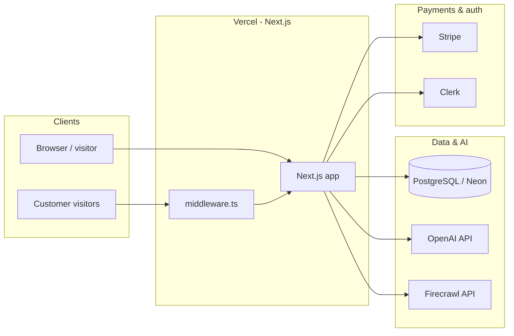
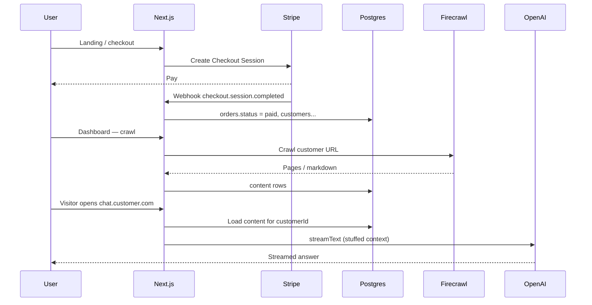
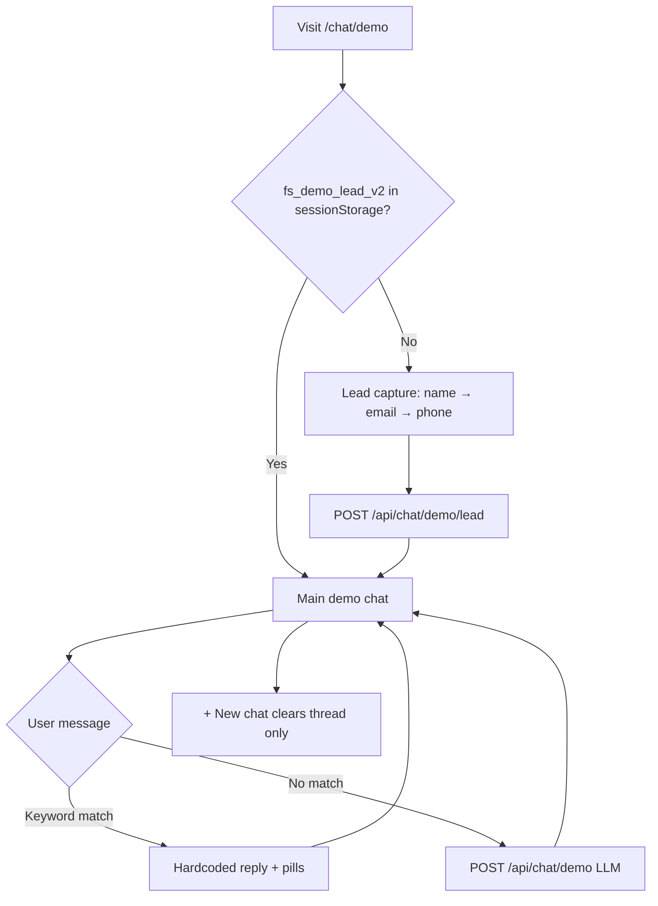

# Architecture & Flow Design — ForwardSlash.Chat

**Last updated:** April 2026  
**Companion:** [TECH-SPEC.md](./TECH-SPEC.md) for file paths and API tables.

This document describes **behavioral** architecture and **user/system flows** at a level suitable for engineering handoff and product alignment.

---

## 1. System context (C4-style)

**Note:** Chat answers for **deployed** bots use text stored in Neon + OpenAI. The **marketing demo** at `/chat/demo` uses a **hybrid** of hardcoded keyword replies and an LLM fed from `data/demo-content.json` (no customer DB).

---

## 2. Primary business flow (happy path)

**Automation gaps** (intentional or roadmap) are described in [APP-STATE-AND-AUTOMATION-PLAN.md](./APP-STATE-AND-AUTOMATION-PLAN.md) and [APP-FLOW-AND-AUDIT.md](./APP-FLOW-AND-AUDIT.md).

---

## 3. Request routing (marketing domain vs customer host)

| Host | Behavior |
|------|----------|
| `forwardslash.chat` (and configured main hosts) | Normal App Router: `/`, `/checkout`, `/dashboard`, `/chat/demo`, etc. |
| **Other hostnames** (e.g. `chat.client.com`) | `middleware.ts` calls `/api/chat/resolve-by-host`; if a `customerId` is found, **rewrite** to `/chat/c/[customerId]`. |

This lets each customer’s chat **live on their domain** without separate deployments per tenant.

---

## 4. Demo funnel flow (`/chat/demo`)

**Force replay intro:** `/chat/demo?forceLead=1` (clears session flag and shows lead steps again).

---

## 5. Customer chat context (production)

Not vector search today: **stuff** recent crawled pages into the system prompt up to a character budget. Implications and limits: [CHAT-CONTEXT.md](./CHAT-CONTEXT.md).

---

## 6. Key state machines (conceptual)

**Order / customer** (simplified; see `db/schema.ts` for exact enums):

- Customer `status`: pipeline from pending through crawling, DNS, testing, delivered.
- Order payment: `pending` → `paid` via Stripe webhook.

**Demo lead** (`demo_chat_leads`):

- Either `skipped = true` (funnel declined), or `skipped = false` with `first_name` + `email` (phone optional).

---

## 7. Where flows are implemented in code

| Flow | Primary files |
|------|----------------|
| Checkout | `app/checkout/`, `app/api/checkout/stripe/route.ts` |
| Webhook | `app/api/webhooks/stripe/route.ts` |
| Crawl | `app/api/customers/[id]/crawl/route.ts` |
| Customer chat | `app/api/chat/route.ts`, `components/CustomerChat.tsx` |
| Demo | `app/chat/demo/page.tsx`, `app/api/chat/demo/route.ts`, `app/api/chat/demo/lead/route.ts` |
| Go-live / DNS | `app/api/customers/[id]/go-live/route.ts`, docs under `docs/VERCEL-*.md` |

---

## 8. Diagram maintenance

When you change a **core** flow (checkout, webhook, crawl, chat), update this file and [TECH-SPEC.md](./TECH-SPEC.md). Mermaid renders in GitHub and most Markdown viewers.
